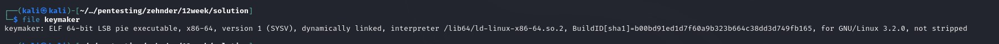
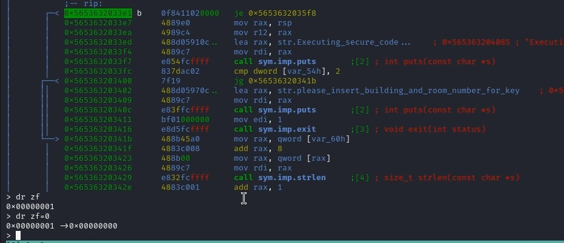
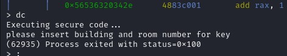
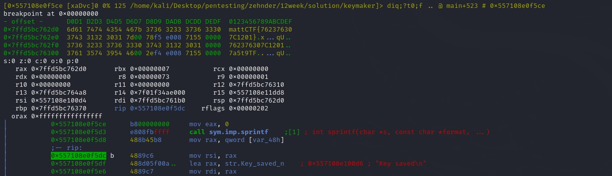

## CTF: 12 Week [Fall25]
Challenge: Saflocked

Category:   RE

Points:  400

Difficulty: Intermediate

## Instructions

I got the [code](keymaker) thats used to make hotel room keys.
Can you figure out how it works to get a key that will work for.
Hotel: mattCTF
Room: 759

Hints: 
1. What flags do Jumps use?
2. Don't think you need all the functions.
3. What datas hidden in the stack?

## Solution
Find what kind of file it is 

access denied   
doesn't get far when ran

Geting over jump using fake zf flag   
> set to 0   

Need to insert the hotel and room number:
 

need to set a beak point near the end to see variables

rax happened to contain the flag in the place I jumped

Without rax, a variable generated by r2 was a double pointer to the flag.

## Flag
mattCTF{762376307C1201}

## Mitigation
Use more obfuscation that would require more working around which would slow the attacker down more. This could be done by having checks done within the functions called. The code checks the mac address and compares it to a known mac, it could instead encrypted based off of that mac address and then someone would think there key is right but it is not. 
