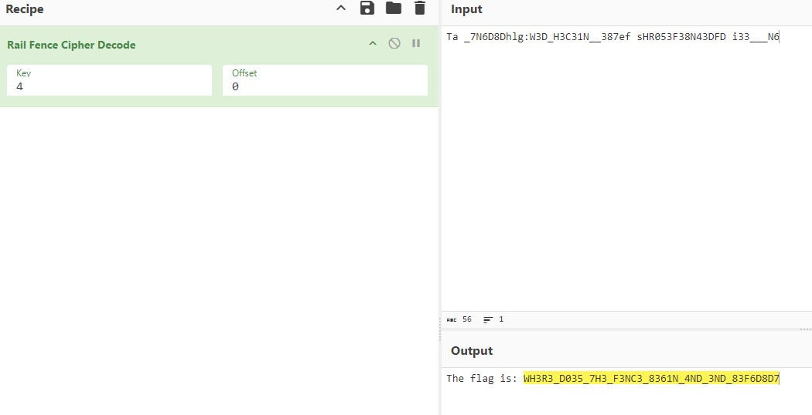

## CTF: Cryptographic Analysis Fall AY25
Challenge: rail-fence 

Category: crypto

Points:

Difficulty: Introductory | Intermediate

## Instructions

A type of transposition cipher is the rail fence cipher, which is described here. Here is one such cipher encrypted using the rail fence with 4 rails. Can you decrypt it?
Download the message here.
Put the decoded message in the picoCTF flag format, picoCTF{decoded_message}.

Hint:  
Bapr lbh'ir haqrefgbbq ubj gur pvcure jbexf, vg'f orfg gb qenj vg bhg lbhefrys ba cncre

## Solution
I was given this hidden [message](message.txt)

Ta _7N6D8Dhlg:W3D_H3C31N__387ef sHR053F38N43DFD i33___N6                

Given that it tells me that I need to do a rail fence cipher I will put the message into a rail fence cipher to find the awnser

Since it is a 4 rail I need to break it up into 4 sections on the fence  

Ta   
_7N6D8Dhlg:W3D_H3C31N__387ef   
sHR053F38N43DFD   
i33___N6  

When trying to do the ciper broken up in the given formatt I get

T     a 
 _   7 N   6 D   8 D   h l   g     : W   3 D _H3C31N__387ef 
  s H   R 0   5 3   F 3   8 N   4 3   D F   D 
   i     3     3     _     _     _     N     6                

Where the words dont line up so I am going to do it again but with using 
 
K=(L)/2(N-1)

To find how big each block of words is supposed to be both with and without spaces

T     a     _     7     N     6     D     8     D 
 h   l g   : W   3 D   _ H   3 C   3 1   N _   _ 3
  8 7   e f   s H   R 0   5 3   F 3   8 N   4 3   D F
   D     i     3     3     _     _     _     N     6

After some tral and error on this [file](decoded_message) I got the above response which i expect is wrong since it is off by about 2 to spell the flag on the first diagnol.

Upon further investigatoin of putting it into cyber chef my awser was wrong due to the needing of the spaces

## Flag

picoCTF{WH3R3_D035_7H3_F3NC3_8361N_4ND_3ND_83F6D8D7}

## Mitigation

Not let someone find out how many rails are in the rail fence encryption. Do not use rail fence in a situation where the person who whould want to crack it has access to a computer.
