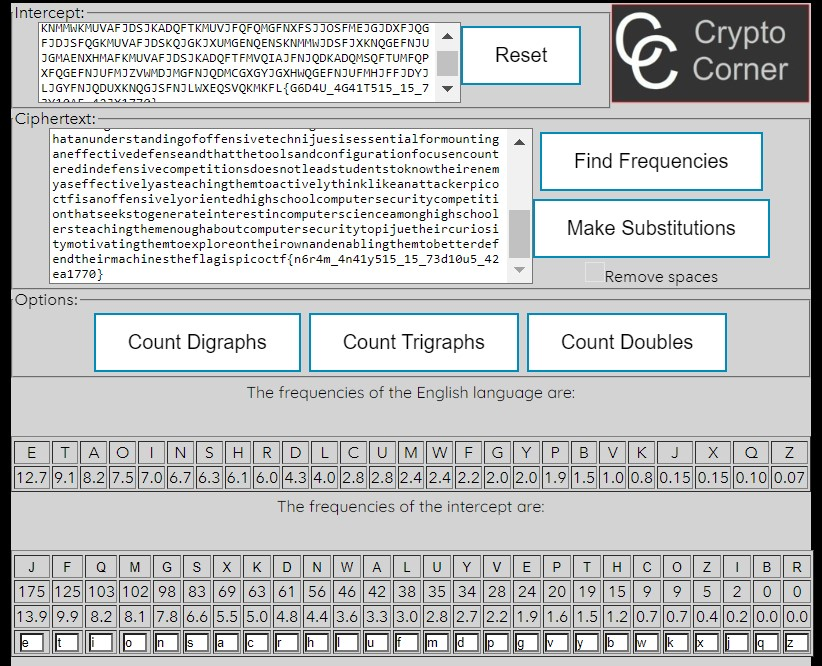

## CTF: Extra Challenges AY25
Challenge: Substitution2 

Category:  crypto

Points:

Difficulty: Intermediate 

## Instructions
It seems that another encrypted message has been intercepted. The encryptor seems to have learned their lesson though and now there isn't any punctuation! Can you still crack the cipher?
Download the message here.

Hints:  
1. Gel ersvavat lbhe serdhrapl nggnpx, znlor nanylmvat tebhcf bs yrggref jbhyq vzcebir lbhe erfhygf?

## Solution
* Due to the name substitution I am going to try different sustitution methods such as ceaser cipher and frequency on the [text](message.txt) they gave me which is:  

> fnjdjjzqsfsjpjdxwmfnjdcjwwjsfxhwqsnjynqensknmmwkmuvafjdsjkadqftkmuvjfqfqmgsqgkwayqgekthjdvxfdqmfxgyaskthjdknxwwjgejfnjsjkmuvjfqfqmgslmkasvdquxdqwtmgstsfjusxyuqgqsfdxfqmglagyxujgfxwscnqknxdjpjdtasjlawxgyuxdojfxhwjsoqwwsnmcjpjdcjhjwqjpjfnjvdmvjdvadvmsjmlxnqensknmmwkmuvafjdsjkadqftkmuvjfqfqmgqsgmfmgwtfmfjxknpxwaxhwjsoqwwshafxwsmfmejfsfayjgfsqgfjdjsfjyqgxgyjzkqfjyxhmafkmuvafjdskqjgkjyjljgsqpjkmuvjfqfqmgsxdjmlfjgwxhmdqmasxllxqdsxgykmujymcgfmdaggqgeknjkowqsfsxgyjzjkafqgekmglqeskdqvfsmlljgsjmgfnjmfnjdnxgyqsnjxpqwtlmkasjymgjzvwmdxfqmgxgyquvdmpqsxfqmgxgymlfjgnxsjwjujgfsmlvwxtcjhjwqjpjxkmuvjfqfqmgfmaknqgemgfnjmlljgsqpjjwjujgfsmlkmuvafjdsjkadqftqsfnjdjlmdjxhjffjdpjnqkwjlmdfjknjpxgejwqsufmsfayjgfsqgxujdqkxgnqensknmmwsladfnjdcjhjwqjpjfnxfxgagyjdsfxgyqgemlmlljgsqpjfjkngqiajsqsjssjgfqxwlmdumagfqgexgjlljkfqpjyjljgsjxgyfnxffnjfmmwsxgykmglqeadxfqmglmkasjgkmagfjdjyqgyjljgsqpjkmuvjfqfqmgsymjsgmfwjxysfayjgfsfmogmcfnjqdjgjutxsjlljkfqpjwtxsfjxknqgefnjufmxkfqpjwtfnqgowqojxgxffxkojdvqkmkflqsxgmlljgsqpjwtmdqjgfjynqensknmmwkmuvafjdsjkadqftkmuvjfqfqmgfnxfsjjosfmejgjdxfjqgfjdjsfqgkmuvafjdskqjgkjxumgenqensknmmwjdsfjxknqgefnjujgmaenxhmafkmuvafjdsjkadqftfmvqiajfnjqdkadqmsqftumfqpxfqgefnjufmjzvwmdjmgfnjqdmcgxgyjgxhwqgefnjufmhjffjdyjljgyfnjqduxknqgjsfnjlwxeqsvqkmKFL{G6D4U_4G41T515_15_73Y10A5_42JX1770}

When doing a bruteforce roll on [CyberChef](https://gchq.github.io/CyberChef/)of all the options it gave me nothing of value 

I am going to try frequency now on [Crypto corner](https://crypto.interactive-maths.com/) :

> thereexistseveralotherwellestablishedhighschoolcomputersecuritycompetitionsincludingcyberpatriotanduscyberchallengethesecompetitionsfocusprimarilyonsystemsadministrationfundamentalswhichareveryusefulandmarketableskillshoweverwebelievetheproperpurposeofahighschoolcomputersecuritycompetitionisnotonlytoteachvaluableskillsbutalsotogetstudentsinterestedinandexcitedaboutcomputersciencedefensivecompetitionsareoftenlaboriousaffairsandcomedowntorunningchecklistsandexecutingconfigscriptsoffenseontheotherhandisheavilyfocusedonexplorationandimprovisationandoftenhaselementsofplaywebelieveacompetitiontouchingontheoffensiveelementsofcomputersecurityisthereforeabettervehiclefortechevangelismtostudentsinamericanhighschoolsfurtherwebelievethatanunderstandingofoffensivetechnijuesisessentialformountinganeffectivedefenseandthatthetoolsandconfigurationfocusencounteredindefensivecompetitionsdoesnotleadstudentstoknowtheirenemyaseffectivelyasteachingthemtoactivelythinklikeanattackerpicoctfisanoffensivelyorientedhighschoolcomputersecuritycompetitionthatseekstogenerateinterestincomputerscienceamonghighschoolersteachingthemenoughaboutcomputersecuritytopijuetheircuriositymotivatingthemtoexploreontheirownandenablingthemtobetterdefendtheirmachinestheflagispicoctf{n6r4m_4n41y515_15_73d10u5_42ea1770}

## Flag

picoctf{n6r4m_4n41y515_15_73d10u5_42ea1770}

## Mitigation

If doing a freqency encrytion the person decyphering the encryption should know the key and there shouldn't be a paragraph that allows the key to be deycrypted by guess and check.