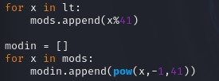
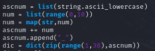
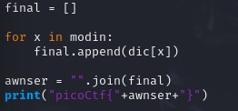
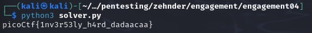

## CTF: Enagement [AY25]
Challenge:  basic-mod2

Category:  crypto

Points:

Difficulty:   Intermediate 

## Instructions
A new modular challenge!  
Download the message [here](message.txt).  
Take each number mod 41 and find the modular inverse for the result. Then map to the following character set: 1-26 are the alphabet, 27-36 are the decimal digits, and 37 is an underscore.  
Wrap your decrypted message in the picoCTF flag format (i.e. picoCTF{decrypted_message})

## Solutions
I need to make a [code](solver.py) that mods the numbers then finds the modular inverse of the result.  
for finding inverse modular

    pow(n, -1, m)

then I need to make a library with the approriate corresponding values

I then needed to iterate through the modins puting the libary values in a list to be joined

Which resulted in 

## Flag

picoCtf{1nv3r53ly_h4rd_dadaacaa}

## Mitigation
Instead of having a secert method to dechiper the seceret it would of been better if they used an actual encryptionor ceipher program. Relying on keeping the method of decryption a secert is not agood way to stop people as it is better to have an open but secure method.
