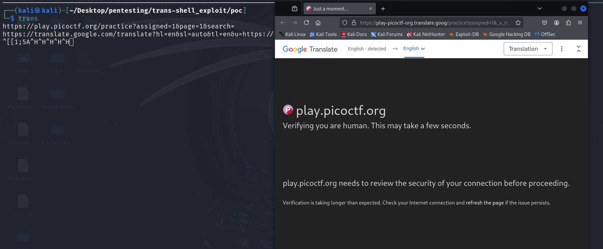

## Open Redirect on trans-shell

This exploit allows you to open any url while using trans.

In order to do this all you have to do is type https:// before whatever you type and it will take you to that website, but that website is opened with in google translate. 

This can allow you to open malisious websites or log into profiles if the translater is running on a different server 

We discovered it whtn we realised that the code queried google every time it completed a translation. From there we tried inserting a url and it took us to the browser where we were able to insert whatever website we wanted. 

Mitgations for this include using a filter of what can be sent through the translator or use sanitation which would remove possibly harmful characters.
