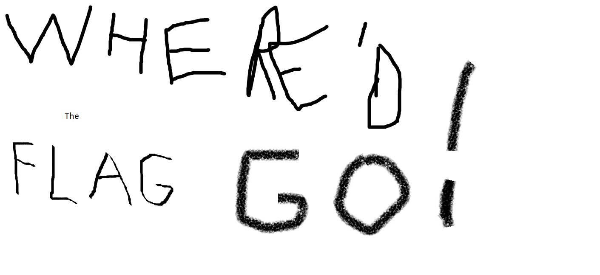
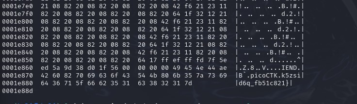
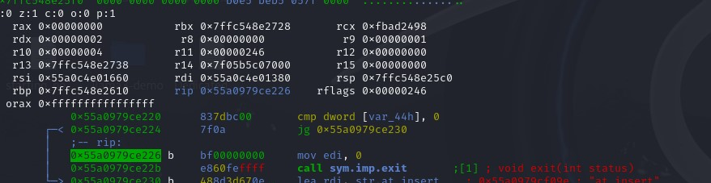
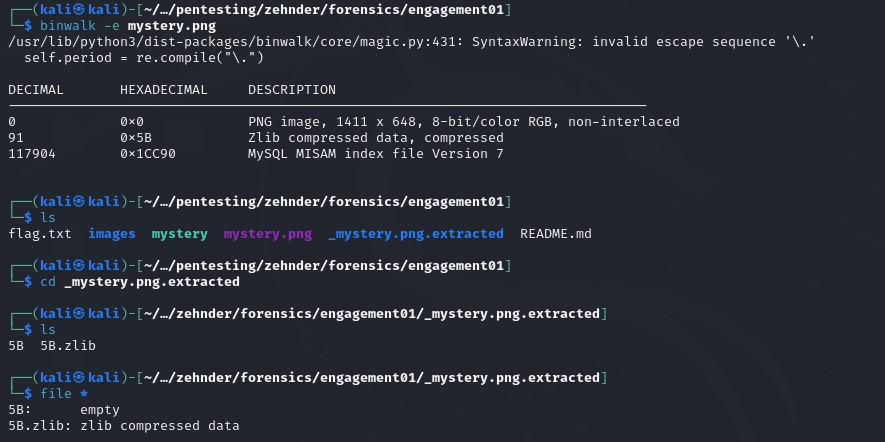
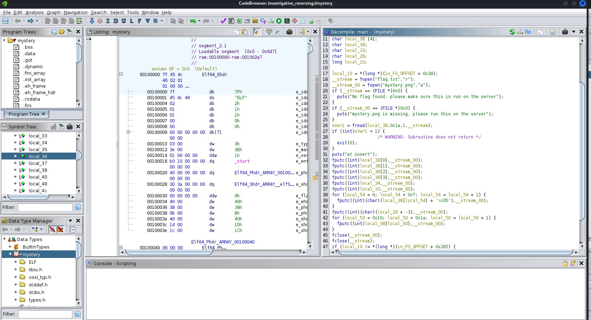
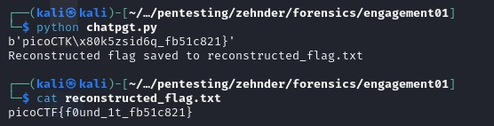

## CTF: Extra Callenges AY25
Challenge: Investigative Reverseing 0

Category:   RE | forensics

Points:     400

Difficulty:  Advanced 

## Instructions

We have recovered a binary and an image. See what you can make of it. There should be a flag somewhere.

Hints: 
1. Gel hfvat fbzr sberafvpf fxvyyf ba gur vzntr
2. Guvf ceboyrz erdhverf obgu sberafvpf naq erirefvat fxvyyf
3. N urk rqvgbe znl or urycshy
## Solution

I need to look in the imgage

What I found at the end of the hex dump

The other file is a elf file

When running the mystery code

When looking at strings of mystery found 

Think I need to find a way to send mystery.png into the mystery.

When creating a flag.txt file no error poped up running the code.

From what looks like part of the flag in the bottom of mystery.png in Imagine it has something to do with the last bytes of the image

It seems I have 2 options recreate the code in python or find where it kicks me out and get past that part to find the awser

I found were it kicks me out need to get past this jump and it might give me the awnser

I tried putting it though binwalk but found nothing of use inside it.

I decided to put it in ghidra and had it spit out the [code](mystery_interpreted.c) in c

Put the givin code into chatgpt to construct a reverse version of the [code](chatgpt.py) which I edited to have the code hit the proper bytes

which then printed out the flag into [reconstructed_flag.txt](reconstructed_flag.txt)

What the code was change the ascii plus or minus the correct amount to get the desired characters in the flag.

[Chat gpt logs](gptlogs)
## Flag

picoCTF{f0und_1t_fb51c821}

## Mitigation
Some mitigations you can do to prevent this could be to encrypt the message with an acutal encryption making it much harder to find the flag. Another options if they needed to make tha flag this way would be to use obstruction making the code more confusing to follow so it would take longer to reverse engineer.
