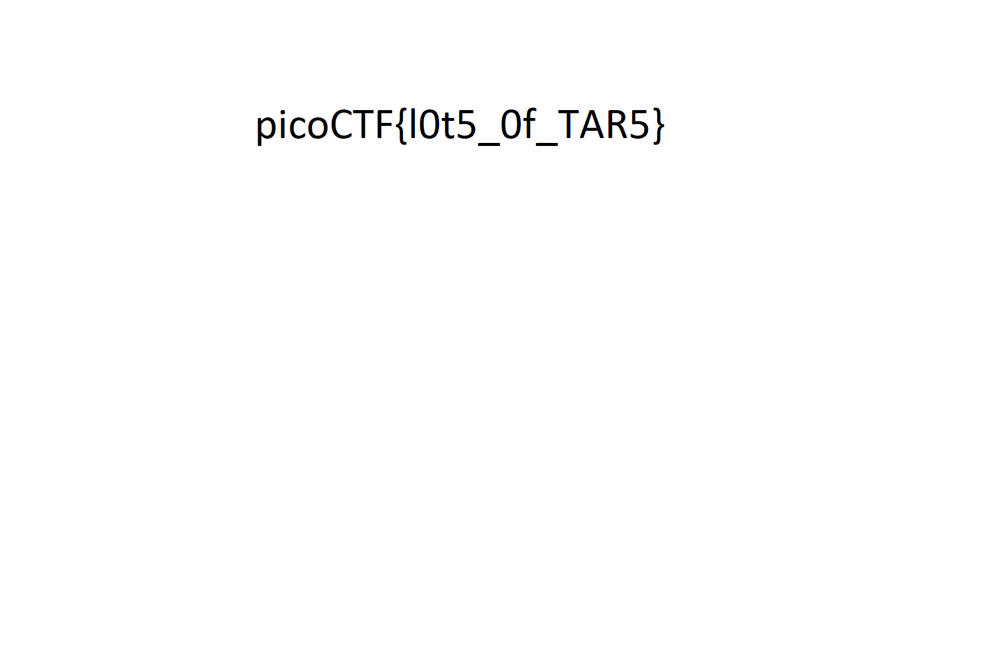

## CTF: Forensics AY25
Challenge: like 1000 

Category:  forensics

Points:

Difficulty:  Intermediate

## Instructions
This .tar file got tarred a lot.

## Solution

Given a tar archive time to extract.

I need to un tar the file alot 

I made a [script](solver.sh) that automaticly extracted all of the tar

It gave me the the flag via png 

## Flag

See above

## Mitigation

[ Describe the security issue that this problem highlights ]
[ What action could you take or what code could you modify to protect an organization with this vulnerability? ]
