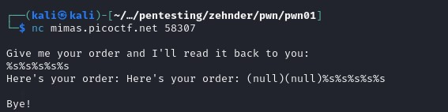
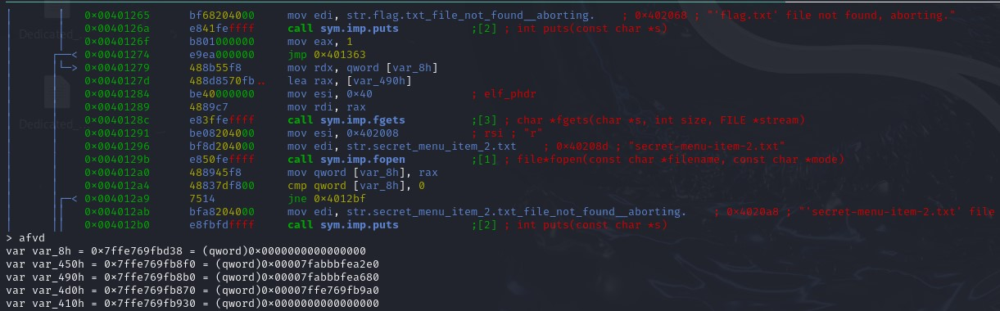

## CTF: Binary Explotation AY25
Challenge: format string 1 

Category:   pwn 

Points:

Difficulty:     Advanced 

## Instructions
Patrick and Sponge Bob were really happy with those orders you made for them, but now they're curious about the secret menu. Find it, and along the way, maybe you'll find something else of interest!
Download the binary here.
Download the source here.
Additional details will be available after launching your challenge instance.

Hints:
1. uggcf://yrggvrev.vrg.havcv.vg/unpxvat/sbezng-fgevatf.cqs
2. Vf guvf n 32-ovg be 64-ovg ovanel?

## Solution
File type:

Its a 64 bit file

While looking through the code think I found the vulnrablity 

There is a scanf that gets put directly into a printf, just need to know what to type to get the flag.

What happens when you run the code

When trying to print strings

Think I need to get the address of the flag

Think the address is 0x7ffe769fb8b0

I'll try to enter “\xb0\xb8\x9f\x76\xfe\7f%c%c%s"
It did not work

The location of buffer is edp -410 and flag is edp-490
so they are 0x80 128 bytes apart
The flag is 128 bytes away = 16 stack lines
it after five %lx it starts to move through the stack line 
If it is already on buffe it should work after 5 + 16 = 21 if it starts at the start of the stack it should take 146 + 5 = 151

%lx%lx%lx%lx%lx%lx%lx%lx%lx%lx%lx%lx%lx%lx%lx%lx%lx%lx%lx%lx%lx%lx
When doing the above I get 

When converted from hex to ascii you get 

{FTCocip 5_14m1n4 4x4_31y7 56_g41f_ }

picoCTF{4n1m41_57y13_4x4_f14g_65}

{FTCocip 5_14m1n4 4x4_31y7 56_g41f_ }14d095

picoCTF{4n1m41_57y13_4x4_f14g_65590d41}

In order to get all of the data to be dumped I needed 18 %lx which was 18 * 8 bytes dumped
## Flag

picoCTF{4n1m41_57y13_4x4_f14g_65590d41}

## Mitigation

You could avoid printing the variable as it is and instead use %s to print a string. Another solution would be to put a max buffersize on the scanf so it would be difficult to be able to dump all of the data.
