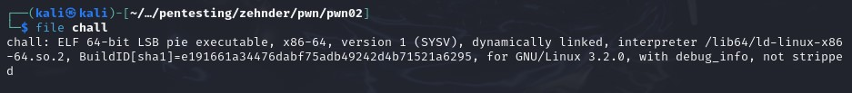
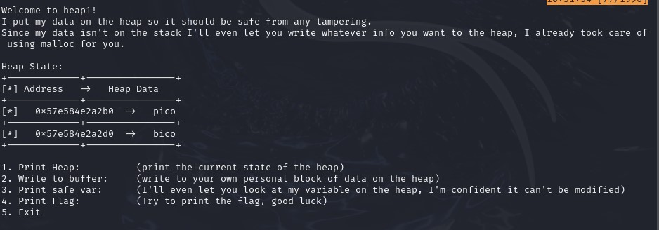
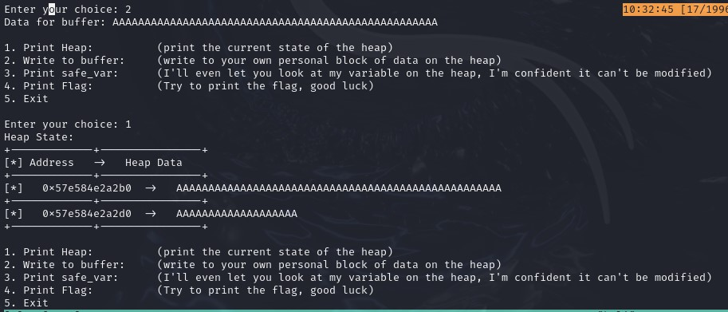
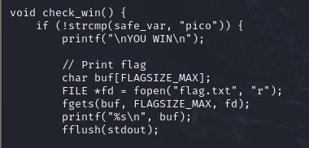
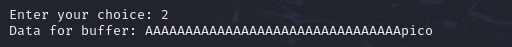
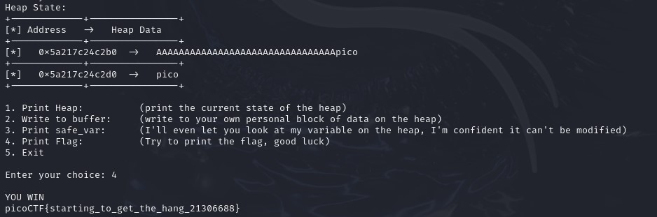

## CTF: Binary Explotation AY25
Challenge: 

Category:   pwn 

Points:

Difficulty:    Intermediate | Advanced 

## Instructions
Can you control your overflow?
Download the binary here.
Download the source here.
Additional details will be available after launching your challenge instance.

Hints:
1. Ubj pna lbh gryy jurer fnsr_ine fgnegf?

## Solution

File type 64-bit

What I get when running the code

I need to save over safe_var I think

Know I can just have to be more accurate withe the wirte data to let me read the flag

Looking at the code I need to make safe_var = pico

The  top one that I directly write into and safe_var are 0x20 away so i need to write 32 bytes of filler then pico to make safe_var pass the test case to print the flag

AAAAAAAAAAAAAAAAAAAAAAAAAAAAAAAApico

## Flag

picoCTF{starting_to_get_the_hang_21306688}

## Mitigation
To stop someone from doing this you can make it so someone can not write directly onto the heap so they can not overlap existing variables. If they need to be able to write directly onto the heap make sure important variables are not near the writing location on the heap or have a canary so if it get overwritten then the code wont work.
