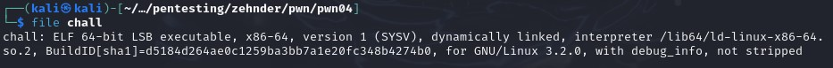
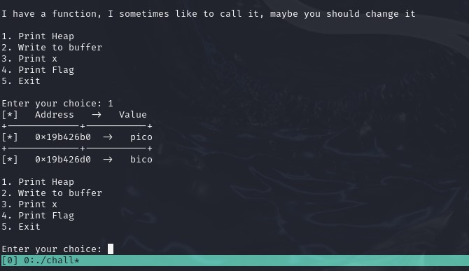
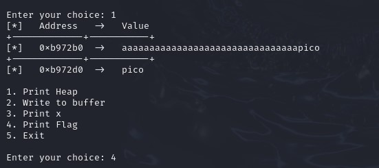
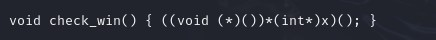
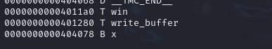
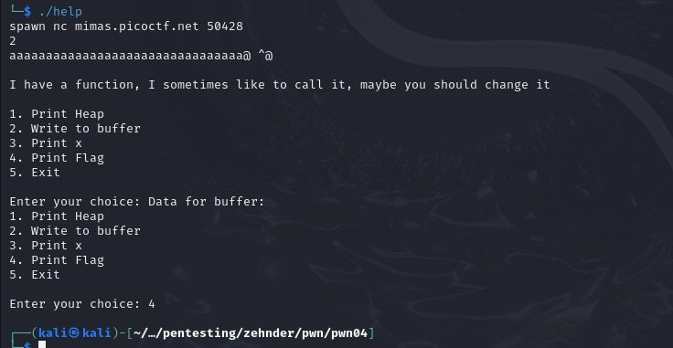
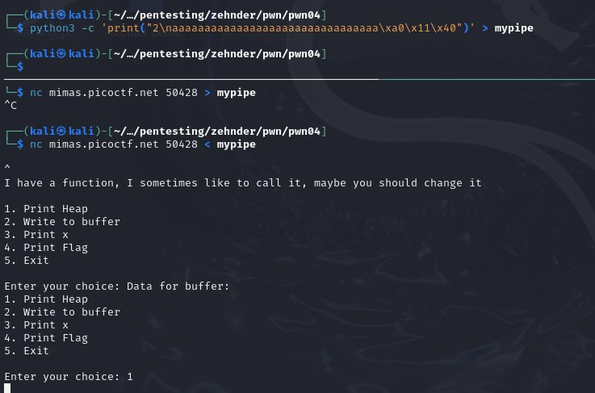
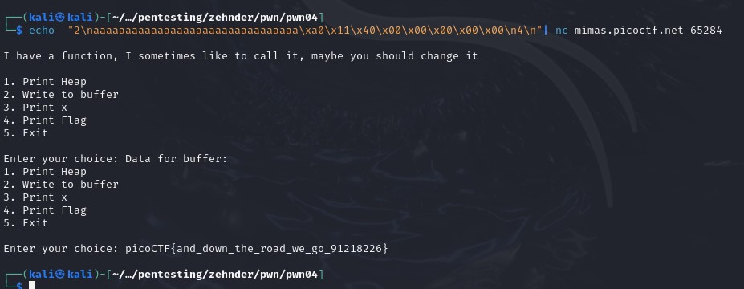

## CTF: Binary Explotation AY25
Challenge: heap 2 

Category:   pwn 

Points:

Difficulty:    Intermediate

## Instructions

Can you handle function pointers?
Download the binary here.
Download the source here.
Additional details will be available after launching your challenge instance.

Hints:
1. Ner lbh qbvat gur evtug raqvnaarff?

## Solution

Type of file: 64 bit 

What happens when I run the code: 
 

It appears to overflow into the next sectino after 32 bytes 

Need to do something like this:

> aaaaaaaaaaaaaaaaaaaaaaaaaaaaaaaapico

When entering pico into x there it does not give the awnser just ends the program

I may need to make it a number since the code says:

Need to find what that does and how to make it true:
1. need to make it a number?  
    no

Asked [chatgpt](chatgpt) it reads x and treats the value as a address to a function and runs the function

So i need to make x the address of win()

need to make x = 4011a0

> aaaaaaaaaaaaaaaaaaaaaaaaaaaaaaaa4011a0

It did not work I need to use python to type in bit mode

Tryed to use python and printf but biggest trouble is finding out how to send input from program mid code runing 

The code seems to freeze when i do alot of the methods

Every method I tried seemed to freeze the code 

The one that worked was echo 

## Flag

picoCTF{and_down_the_road_we_go_91218226}

## Mitigation
In order to mitigate this you need to set buffer sizes for your scanfs so that they can not overwite to other areas in the heap. Also not include a variable that is used to call a function so you don't have to worry about it getting changed before it is called.
