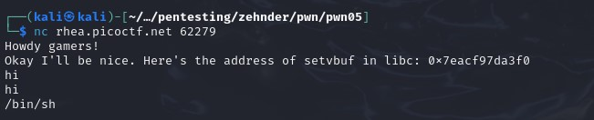
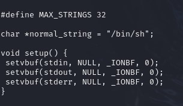
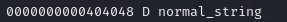
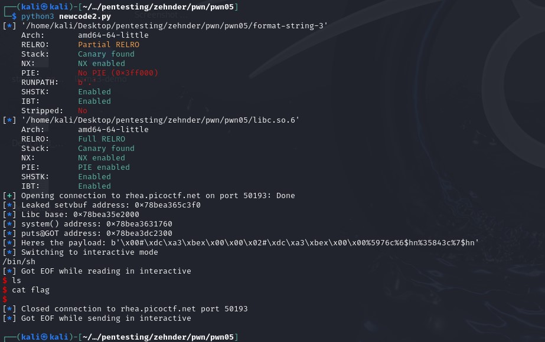
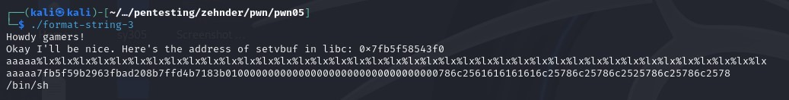
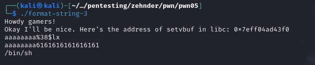

## CTF: Binary Explotation AY25
Challenge: Format string 3 

Category:   pwn 

Points:

Difficulty:    Intermediate | Advanced 

## Instructions

This program doesn't contain a win function. How can you win?
Download the binary here.
Download the source here.
Download libc here, download the interpreter here. Run the binary with these two files present in the same directory.
Additional details will be available after launching your challenge instance.

Hints: 
1. Vf gurer nal jnl gb punatr jung n shapgvba cbvagf gb?

## Solution
I need to find out how to change the address of I think setvbuf to normal string so it opens up a shell so I can find the flag

what happens when I run the code

I need to do something with  normal_string 

maybe need to change it so setvbuf points to it or it points to setvbuf

location of normal strings  

When comparing the address of the first %p in the printf is 0x15e573 higher than the setvbuf address 
I think I need to repoint puts to system() to make it use /bin/sh instead of just print it.

When trying to use pwn_formatstr the address of setvbuf is to large 

I had [Chatgpt](chatgpt) write me a [code](codwriter.py) for changing the pointer of puts to system. But I can not find out how to insert the code into it mid code since I need to find out what the GOP positions is sice the location changes everytime so I need to change the code for each try.

I could not figure out how to do this one but I know I need to get the base location of libc using setvbuf - setvbuf_offset = base than add system offset to find the system address and add the puts offset to find the puts Address. From there I need to use them to write the system address to teh puts address so when puts(normal_string) ran it would open a shell tha I could use to cat flag.txt

I used chatgpt to write me a code using pwn tools to write over the puts poiter to the system pointer. 

I have not gotten it working but am trouble shooting to get it open the shell 

After alot of trial and error I hope im on the right track the resulting address I think are off so I have to fine tune them to make sure they are right if thats even what I have to do.

after doing more experimentation I think I need to add more padding and look further %#$n than I thought

> aaaaaaaa%lx.%lx.%lx.%lx.%lx.%lx.%lx.%lx.%lx.%lx||%lx.%lx.%lx.%lx.%lx.%lx.%lx.%lx.%lx.%lx||%lx.%lx.%lx.%lx.%lx.%lx.%lx.%lx.%lx.%lx||%lx.%lx.%lx.%lx.%lx.%lx.%lx.%lx.%lx.%lx||%lx.%lx.%lx.%lx.%lx.%lx.%lx.%lx.%lx.%lx||

> aaaaaaaaa%38$lx

## Flag

[ The flag here ]

## Mitigation

A mitigation could be to limit the size of the scanf so you could not wirte the very high number you need to to copy the addressed. Could not directly put the string variable in puts() it could go in %s in printf(). Or you could limit the types of charcter the person can enter into the system, use an if statment to not allow % signs or /. 
