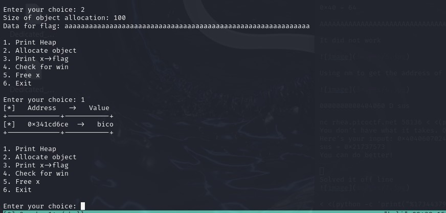

## CTF: Binary Explotation AY25
Challenge: heap 3

Category:   pwn 

Points:

Difficulty:    Intermediate 

## Instructions
This program mishandles memory. Can you exploit it to get the flag?
Download the binary here.
Download the source here.
Additional details will be available after launching your challenge instance.

Hints:
1. Purpx bhg "hfr nsgre serr"

## Solution

Need to find what type of file = 64 bit

What happens when running the code

Need to free x so we can overwite it, try to put alot in to overwrite it

Doesn't overwrite needs to be more accurate

Seems like the flag is in a 35 char size struct with the flag, need to create a 35 char object after freeing x in order to cover the data that was in flags place.

> aaaaaaaaaabbbbbbbbbbccccccccccpico

## Flag

picoCTF{now_thats_free_real_estate_a11cf359}

## Mitigation

After freeing x you could make it so that x becomes a null pointer pointing to something else so nothing else can write over it. Or after freeing x it could be allocated to a different place so it wouldn't allow another object to overwirte where it is so easily.