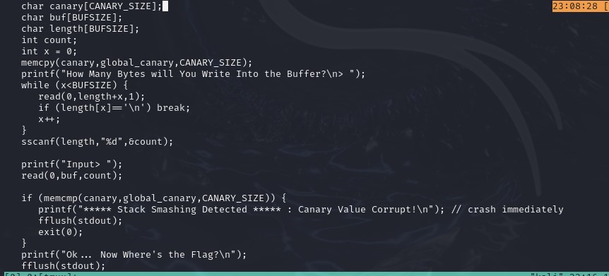

## CTF: Binary Explotation AY25
Challenge: buffer overflow 3 

Category:   pwn 

Points:

Difficulty:      Advanced 

## Instructions

Do you think you can bypass the protection and get the flag?
It looks like Dr. Oswal added a stack canary to this program to protect against buffer overflows. You can view source here. And connect with it using:

Hints: 
1. Znlor gurer'f n fzneg jnl gb oehgr-sbepr gur pnanel?

## Solution
The type of file: 32 bit 

I think I need to change the address of some function to the win function since the win function is never called

need to find how close they are to the buf I'm writing to.

When trying to put alot of charcter in the buf it still didn't overwirte the canary I think that theres another safe gaurd only readin a certeain number of byte in.

need to see how far away the canary is 

> aaaaaaaaaaaaaaaaaaaaaaaaaaaaaaaaaaaaaaaaaaa
> aaaaaaaaaaaaaaaaaaaaaaaaaaaaaaaaaaaaaaaaaaaaaaaaaaaaaaaaaaaaaaa

[63 bytes] + [canary] + [freedom]

Figured out how to write the canary and past it 

I created a [code](canarytracker.py) that runs the progarm over and over again untill you get the canary.

> aaaaaaaaaaaaaaaaaaaaaaaaaaaaaaaaaaaaaaaaaaaaaaaaaaaaaaaaaaaaaaa\x0012f4BBBBBBBB\x36\x93\x04\x08

I can not find where to put the address to win() i've spent like 4 hours writing code to repatedly send it and have tried to find it by debugging but its not working

> aaaaaaaaaaaaaaaaaaaaaaaaaaaaaaaaaaaaaaaaaaaaaaaaaaaaaaaaaaaaaaa\x0012f4BBBB\x36\x93\x04\x08

## Flag

[ The flag here ]

## Mitigation

I wasn't able to figure this one out in time but I imagine to mitigate it you could have a pre set buf size so people can't write in to many bytes to overflow in the system. Not make the win function so obvious. could be hidden in the main function so it always changes addresses.
