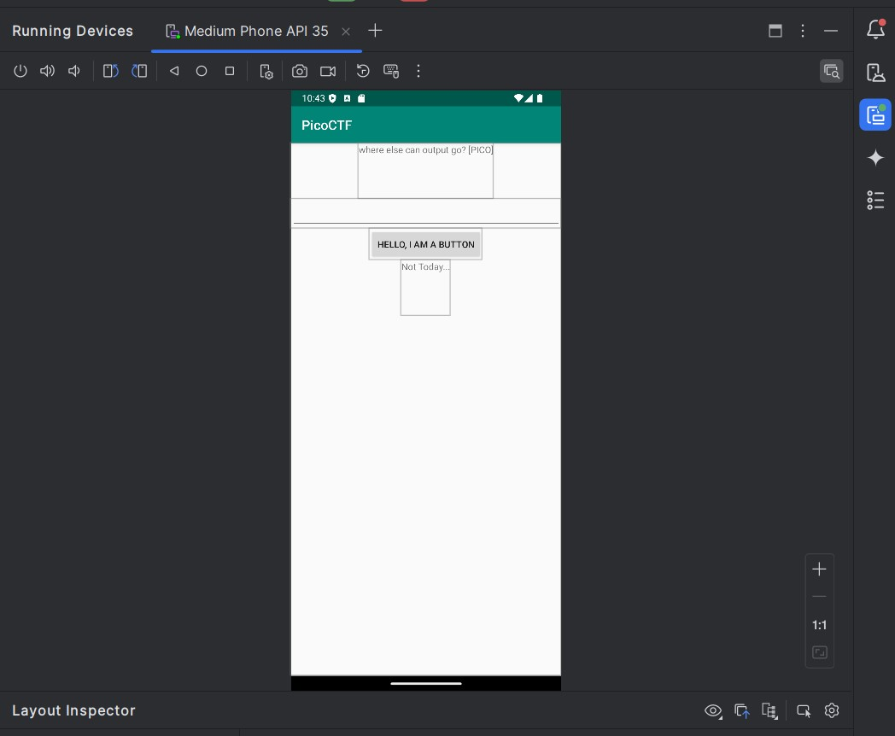
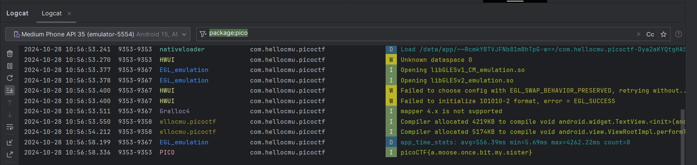

## CTF: Engagement [Fall 25]
Challenge: droids0

Category: RE

Points:

Difficulty: Hard

## Instructions

Where do droid logs go. Check out this file.

Hints:  
1. Gel hfvat na rzhyngbe be qrivpr
2. uggcf://qrirybcre.naqebvq.pbz/fghqvb
## Solution
Larger file = 1.75 Mb

Its an android package

 
Possibly need emulator

Need to find the logs 

> They are stored in a ciruclar buffer = overwritten when full
> Found in andoid simulator under logcat

1. Run start an emulator and run the program 

2. Open the log and look for pico

3. Read the flag
## Flag

picoCTF{a.moose.once.bit.my.sister}

## Mitigation
While it is good practice to log everything that happens in the code you should make sure that any secret or flag is not loged in plaintext. As if it is loged in plain text it can be easily seen by anyone who trys to debugg the code.
