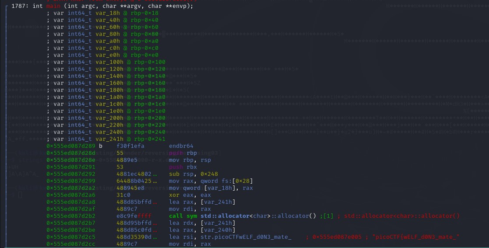
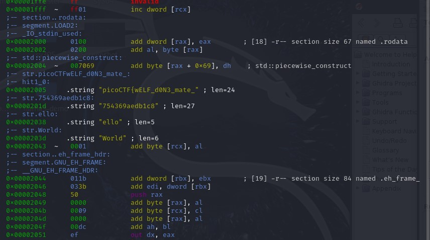
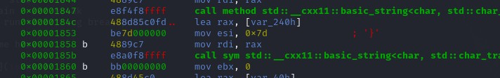
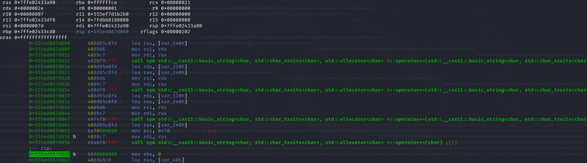
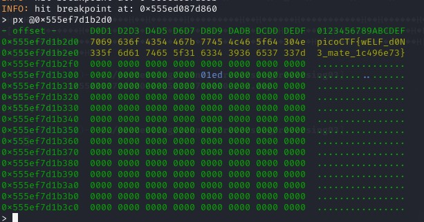

## CTF: Reverse Engineering [Fall AY25]
Challenge: FactCheck

Category:   RE

Points:

Difficulty: Intermediate

## Instructions
This binary is putting together some important piece of information... Can you uncover that information?  
Examine this [file](bin). Do you understand its inner workings?

## Solution

Identify what it is:  
file bin

bin: ELF 64-bit LSB pie executable, x86-64, version 1 (SYSV), dynamically linked, interpreter /lib64/ld-linux-x86-64.so.2, BuildID[sha1]=ed9d01aa375e575eb2cd16506aa83d6951841f87, for GNU/Linux 3.2.0, not stripped

Try doing some things:

upx -d bin = 0 files unpacked (not compressed that way)

objdump -M intel -d bin | less = nothing of interset that is could find possibly with more digging

When trying to find out how to use gdb:

* getting starting breakpoint with: (gdb) info files

* put strating point as break point with: break *0x11a0

* just got errors saying cannot access memory

When looking at strings found:

u+UH  
[]A\A]A^A_  
picoCTF{wELF_d0N3_mate_  
Hello   
World  
:*3$"  
zPLR  
GCC: (Ubuntu 9.4.  0-1ubuntu1~20.04.2) 9.4.0  
crtstuff.c  

**USING R2**

Find the main fuction using  
    aa - anlyze code (give me variable names I can track)  
    ood - start code  
    db main - set break   
    dc - run to hitting break point   

leaving me here

I then tested the code many times trying to figure out how to read the flag string which half is in the .rodata section 

Near the bottom there is a line about writing "}"

I added 2 break points one when a address was read into rax and one after the system call

at the first stop I used dr rax to get the address of the location of the string 

I then px'ed at the address I aquired earlier to get the flag

After finding the flag I realized I could of just px'ed all of the variable address until i found the flag or looked that the variable var_240h/rbp-0x220 was being read everytime before a char was added.

## Flag

picoCTF{wELF_d0N2_mate_1c496e73}

## Mitigation
They could use obfuscation within the code so it would be harder to find where the code flow went so it would be harder to locate the key. Stripping the code would also help make it more difficult to see what was going on in the code.

