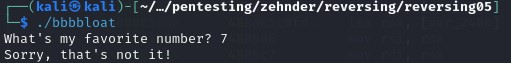

## CTF: Reverse Engineering [Fall AY25]
Challenge: bbbbloat 

Category:   RE

Points:

Difficulty:  Intermediate

## Instructions

Can you get the flag?
Reverse engineer this [binary](bbbbloat).

## Solution
Check the file 

bbbbloat   
bbbbloat: ELF 64-bit LSB pie executable, x86-64, version 1 (SYSV), dynamically linked, interpreter /lib64/ld-linux-x86-64.so.2, BuildID[sha1]=1989eb2c7cb4aad23df277d8aed3c97482740d7a, for GNU/Linux 3.2.0, stripped

When running asks fav number then says is wrong before exiting

finding more about the file

eadelf -h ./bbbbloat     
ELF Header:  
  Magic:   7f 45 4c 46 02 01 01 00 00 00 00 00 00 00 00 00   
  Class:                             ELF64  
  Data:                              2's complement, little endian  
  Version:                           1 (current)  
  OS/ABI:                            UNIX - System V  
  ABI Version:                       0  
  Type:                              DYN (Position-Independent Executable file)  
  Machine:                           Advanced Micro Devices X86-64  
  Version:                           0x1  
  Entry point address:               0x1160  
  Start of program headers:          64 (bytes into file)  
  Start of section headers:          12616 (bytes into file)  
  Flags:                             0x0  
  Size of this header:               64 (bytes)  
  Size of program headers:           56 (bytes)  
  Number of program headers:         13  
  Size of section headers:           64 (bytes)  
  Number of section headers:         29  
  Section header string table index: 28  

Try to learn more using r2

anlyzed the code then looked at main 

found the scanf before it kicks you out

the jump that kicks you out

Jumping over jump

Did not work, but notice the cmp just above the jne(not equal) 

    0x5598b18404cb b    3d87610800     cmp eax, 0x86187 

0x86187 = 549255

tired entering the cmp value 

 

## Flag

picoCTF{cu7_7h3_bl047_44f74a60}

## Mitigation

Instead of comparing the value the person puts into the call directly the value can be encrypted and the two encrypted value can be compared. This way when looking though the code the hacker would see the encrypted value being compared and have no idea what the correct value to enter is.
